<h1  align="center">Google Summer of Code 2024 </h1>

  

<i>A full report on my Google Summer of Code 2024 work with FOSSology</i>

<i>Project: "REST API Improvements" </i> 👨‍💻

  

  

  

## Google Summer of Code 2024 🚩 Report: "REST API Improvements" 

 
About me 

  

Hello, I'm **Valens NIYONSENGA**, a proud Software Engineering, Cybersecurity and Embedded Systems graduate at [**Rwanda Coding Academy**](http://rca.ac.rw/). With over 4 years of proven experience in building and architecting fullstack applications, I'm thrilled to be an active member of the FOSSology community for Google Summer of Code 2024.

  
In this article holds detailed report of my contributions as a reference of my project completion during the 12 weeks of coding at FOSSology in 2024 Google Summer of Code (GSoC).

  

# 🌏 CONTRIBUTIONS Overview

  

During my participation in the Google Summer of Code (GSoC) program, I focused on enhancing the quality of the system by improving and adding new unit and integration tests cases.Through this, I tested all functionalities to verify whether they work as expected and meet the requirements. After finishing unit tests cases development for APIs and models, I improved and wrote new integration tests for Data Access Objects (DAOs).

1.  #### Unit tests development
 
- I developed new unit test cases for all controllers and models contributing to the quality improvement of the software, verifying that API units and models are working as expected.
2.  #### Api test cases upgrade to version 2
- Since my collegue [Divij](https://github.com/dvjsharma) was upgrading REST APIs to version 2, the same to my side, I dedicate my time to upgrade all test cases to version 2.

3.  #### Integration tests development
- Finally, After improving and enhancing some integration tests that were available in Data Access Objects (DAOs), I developed new integration test cases verifying that all DAOs components and database are properly working together to meet the requirements as expected.

## Unit test cases development:

  ### 1.Controllers.
  - MaintenanceControllerTest and UploadTreeControllerTest [#2764](https://github.com/fossology/fossology/pull/2764)
   
  'MaintenanceControllerTest'

  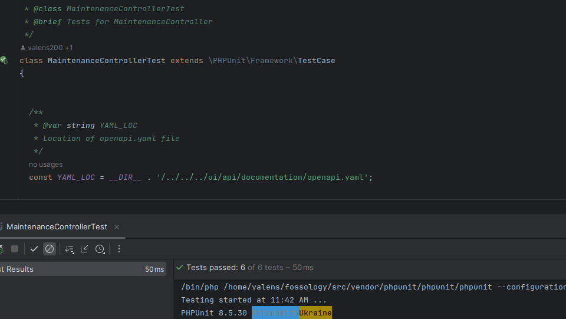 

  'UploadTreeControllerTest'

  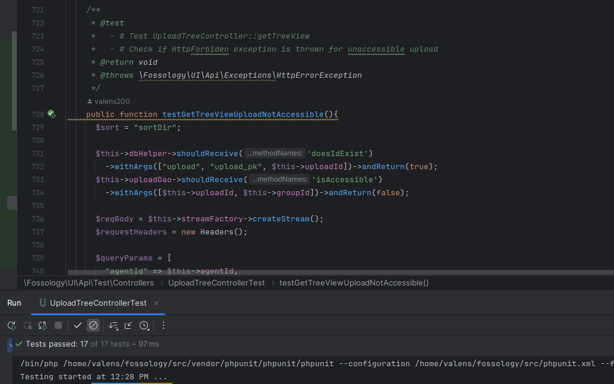

    - 'LicenseControllerTest', GroupControllerTest, 'CopyrightsControllerTest','UploadControllerTest', 'OverViewControllerTest' and 'FolderControllerTest' [#2827](https://github.com/fossology/fossology/pull/2827) and [#2834]https://github.com/fossology/fossology/pull/2834
   
  'LicenseControllerTest'

  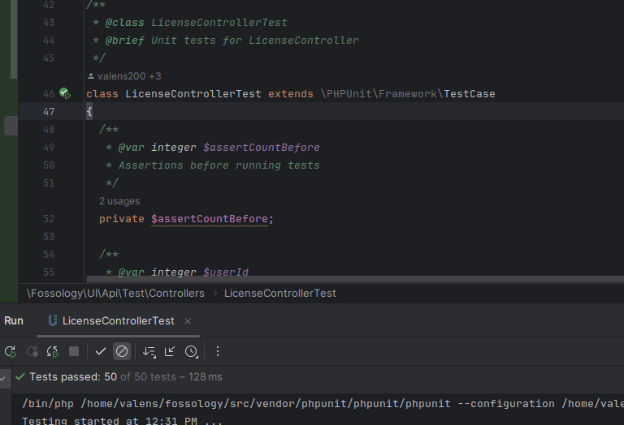 

  'UploadControllerTest'

  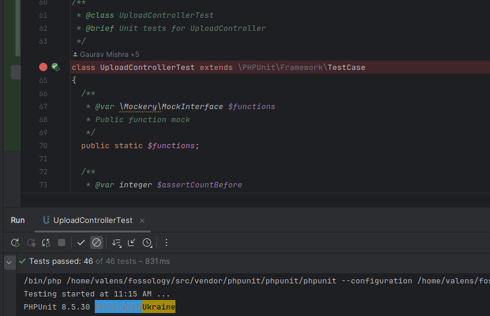

  'FolderControllerTest'

  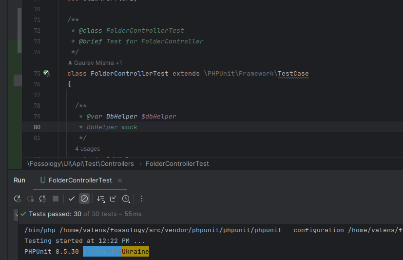

    'GroupControllerTest'

  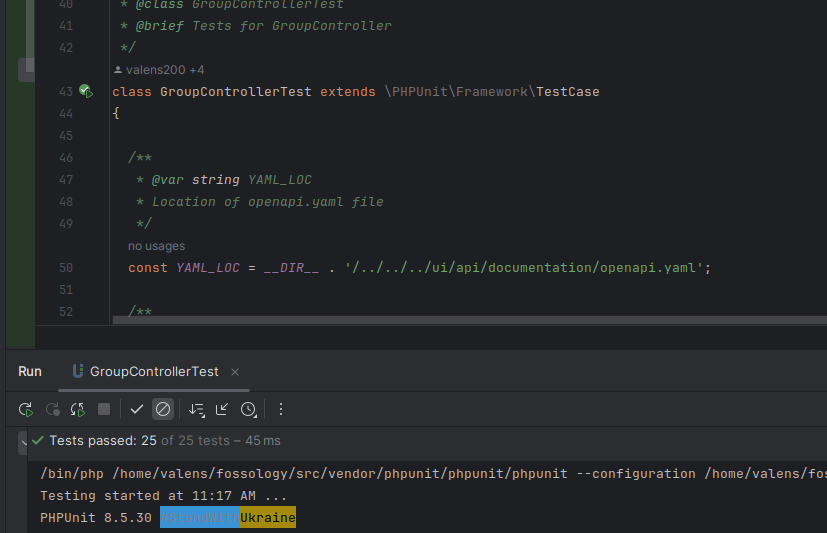

   'CopyrightsControllerTest'

  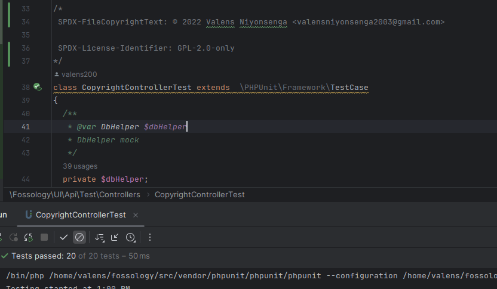 

   'OverViewControllerTest'

  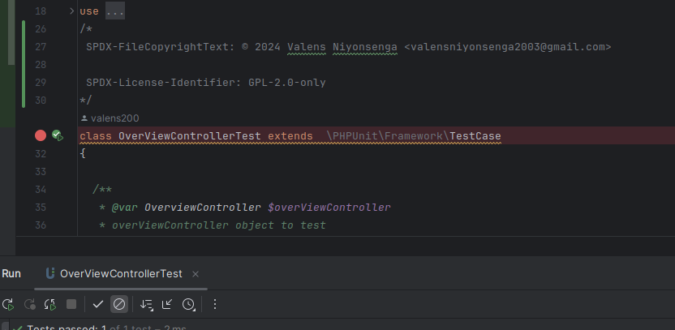 

#### Models test cases.
Models tests are numerous but I would like to show some screenshoots.
 - 'AnaysisTest', 'BulkHistroryTest', 'ScanCodeTest', 'FolderTest' and so on.. [#2825](https://github.com/fossology/fossology/pull/2825)
   
  'AnaysisTest'

  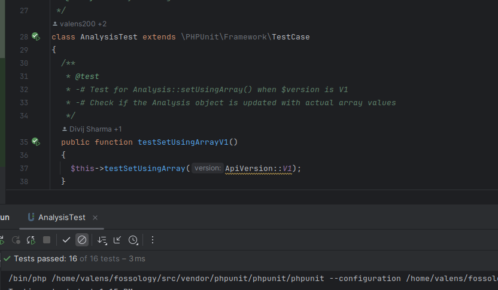 

  'ScanCodeTest'

  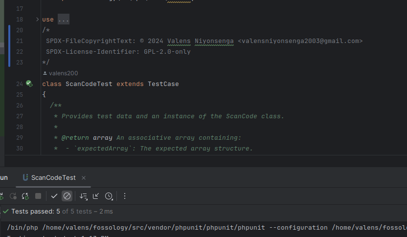

  'BulkHistroryTest'

  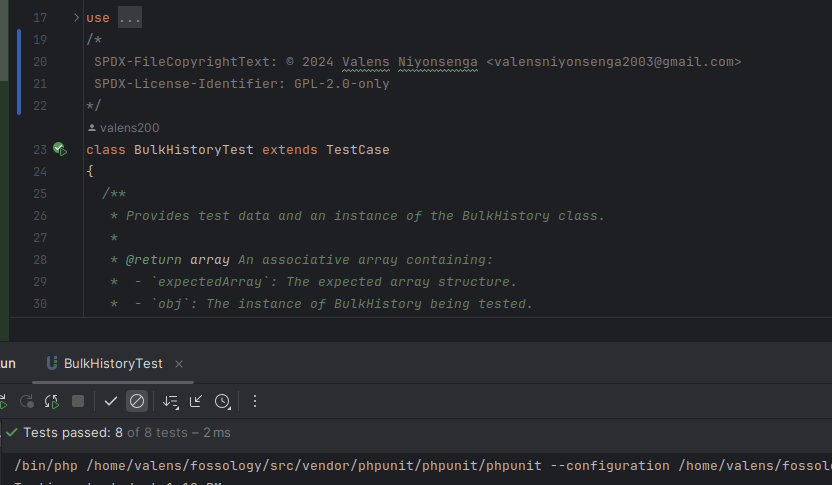 

  'FolderTest'

  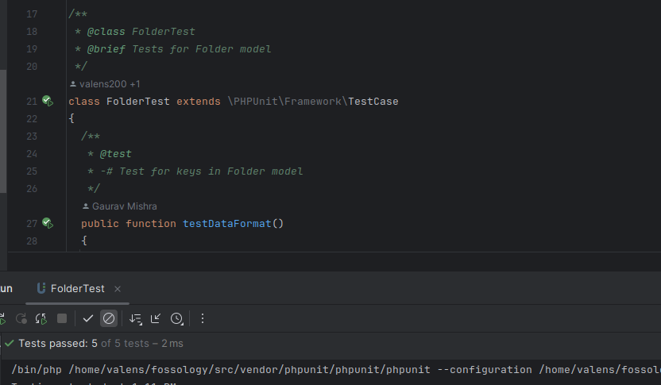

   - 'LicenseCandidateTest', 'AgentTest', 'DeciderTest',and so on.. [#2829](https://github.com/fossology/fossology/pull/2829)
   
  'LicenseCandidateTest'

  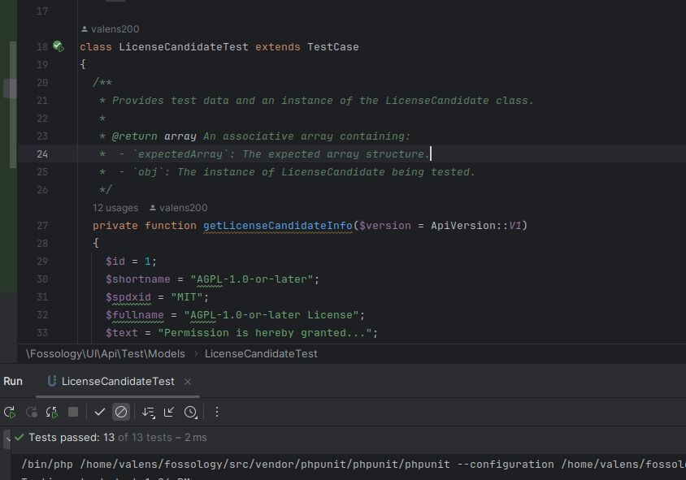 

  'AgentTest'

  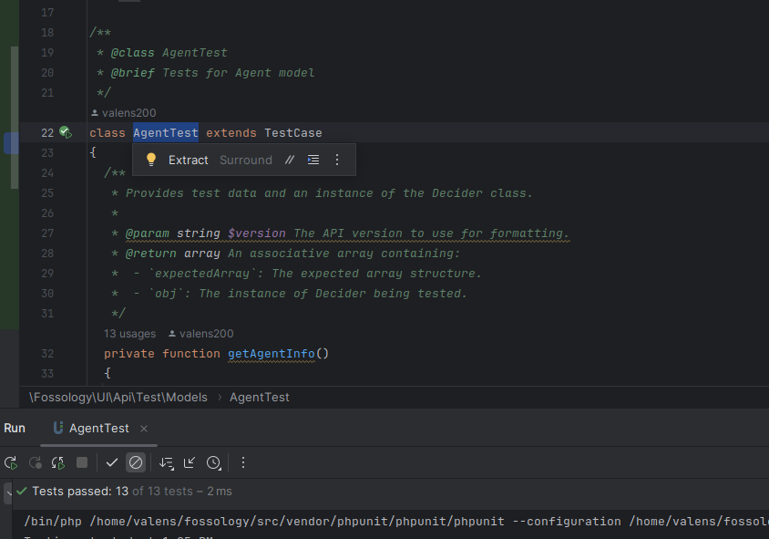

  'DeciderTest'

  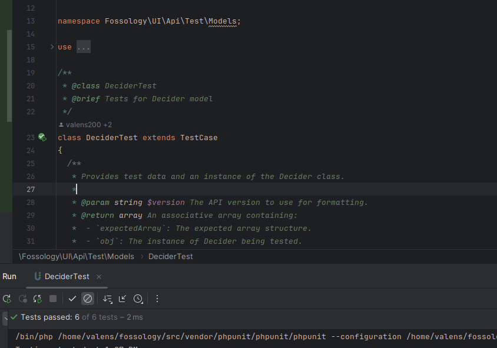 

## Integration test cases development.
   - 'FolderDAOTest'[#2830](https://github.com/fossology/fossology/pull/2830)
   
  'FolderDAOTest'

  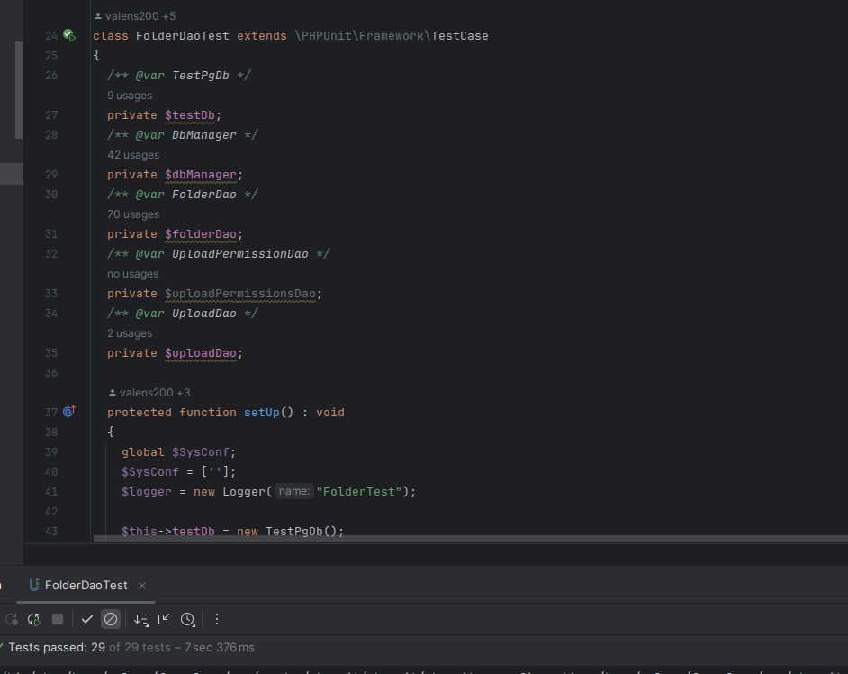 

   - 'PfileDAOTest', 'ShowJobsDAOTest',UploadPermissionsDAOTest', 'UploadDATest' and so on.. [#2832](https://github.com/fossology/fossology/pull/2832)
   

   'UploadPermissionsDAOTest'

  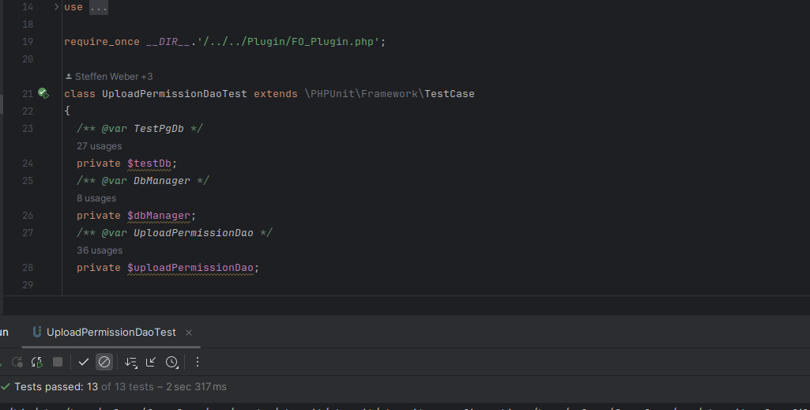 

  'PfileDAOTest'

  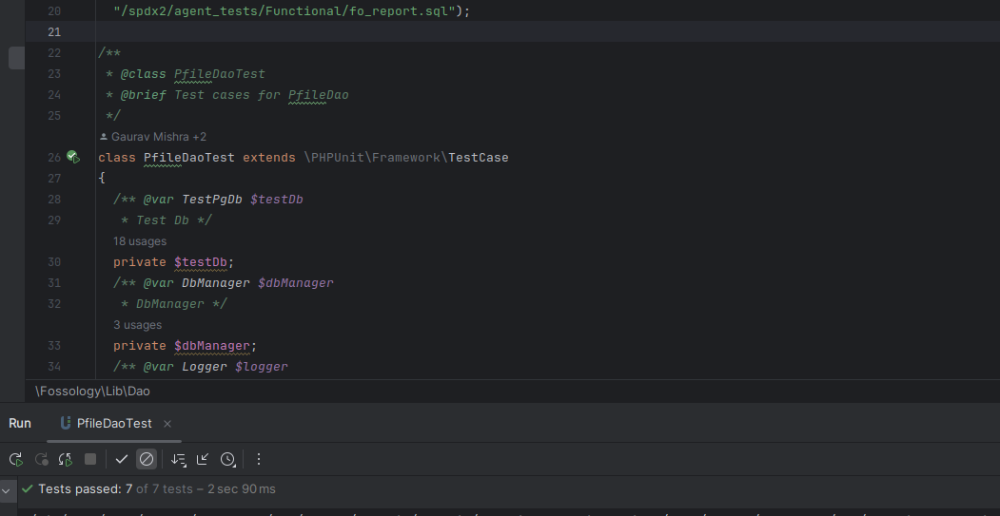 
   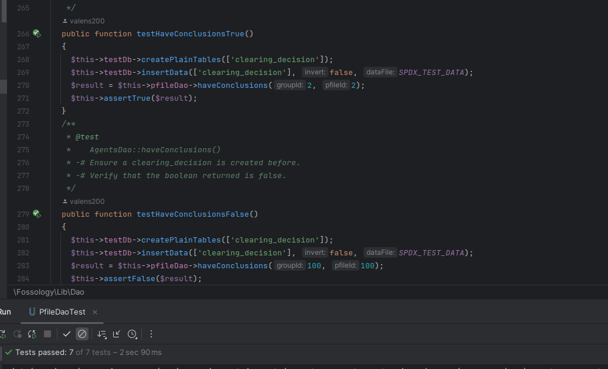 

   'ShowJobsDAOTest'

  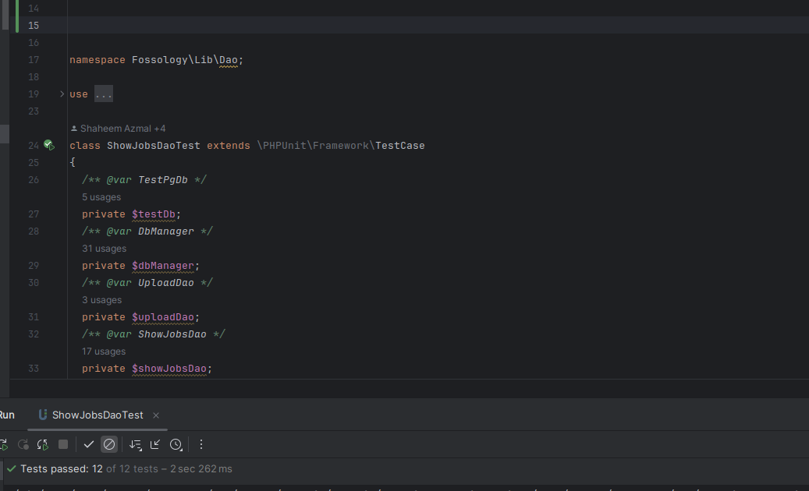 
  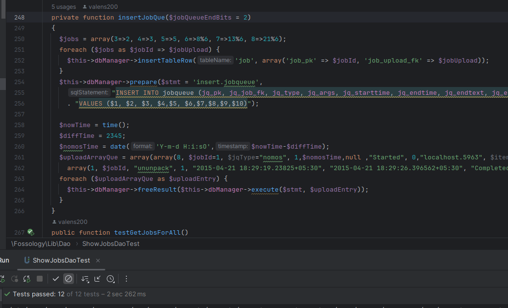 

## Documentation:📄

Throughout the 12 weeks of the GSoC period, I created weekly documentation for recording and tracking my progress. The documentation can be found [**here**](https://fossology.github.io/gsoc/docs/2024/rest/updates/valens/2024-05-30)

<h1 align="center">👨🏻‍🏫 DELIVERABLES </h1>

| Tasks   | Planned | Completed     | Remarks    |
| :---:       |    :----:   |    :---:      |    :---:      |
| Upgrade and Improve all REST API unit tests | Yes | :heavy_check_mark: | 
| I have improved and added new unit tests for APIs | Yes       | :heavy_check_mark: |  |
| Enhanced and added new unit tests for models| Yes        | :heavy_check_mark:  |  |
| Improved and added new integration tests for Data Access Objects| Yes | :heavy_check_mark:(partially) | There's still a work ahead to ensure that all the DAOs follow integration testing standards and also making sure that the test coverage for each is at least 75%. |
| Adding end-to-end tests for APIs | NO  | :x: | I am going to finalize this in coming weeks after GSoC.

## Future ventures:🚀

- #### Implement end-to-end tests for FOSSology APIs:
   To ensure high quality software, there is still a work to do. I look forward to finalizing additional end-to-end tests development for FOSSology APIs to verify that all functionalities are working as expected and meeting the requirements.
In the pipeline are several exciting improvements to look forward to:

- #### Guiding new contributors to FOSSology:
   I look forward to providing a full guidance new contributors for not only contributing to FOSSology Excellence in license compliance but also broadening the open-source family.
- #### Provide more contributions:
   As I started the open-source journey, I won't step back.I will keep my dedication , determination and love to open-source. I will keep contributing to FOSSology, guiding and mentoring new contributors as well.

## Major Takeaways: 📚

- Developed Proficiency in Remote culture.
- Growth in writing clean code, commit messages and opening clear pull requests.
- I learned clear definition of teamwork and collaboration to achieve a common goal.
- Gained Hands-On experience in open-source Contribution.
- Improved my research and exploration skills on new things.
- Enhanced my communication and leadership skills from my mentors.
- Gained skills on reading and understanding large codebases.
- Cleared fear and developed confidence in contributing to large codebases.

<h1 align = "center" id = "acknowledgements">🎓 Acknowledgements</h1>

Being a part of FOSSology was a rewarding experience and journey of growth in my crucial aspects of life. The journey was really exciting more than I expected. As my first  endeavor into open-source, I learned the ropes and gained invaluable skills including communication, teamwork, writing clean code and other technical skills that are very crucial in my future ventures. I deeply extend heartfelt gratitude  for the whole FOSSology team especially my mentors for the kindness, patience and invaluable support they gave me throughtout this journey. 
 
Special thanks to <a href="https://github.com/shaheemazmalmmd" target="_blank">Shaheem Azmal M MD</a>, <a href="https://github.com/GMishx" target="_blank">Gaurav Mishra</a>,  <a href="https://github.com/dushimsam" target="_blank">Samuel Dushimimana</a>, and <a href="https://github.com/soham4abc" target="_blank">Soham Banerjee</a> as my mentors. I really appreciate how humble and polite these people are, their full guidance and support has truly shaped me and made me who I am today.
     
     
    In conclusion, It has been an exciting journey working with this wonderful community, and I've gained so much from the experience. As we move forward, there is always room for improvement in every line of code, keep pushing code!

<h1 align = "center" id = "connections">🌐 Let's connect! </h1>

  

- [LinkedIn](https://www.linkedin.com/in/valens-niyonsenga-947440228/)

- [GitHub](https://github.com/valens200)

- [Twitter](https://x.com/200Valens)
